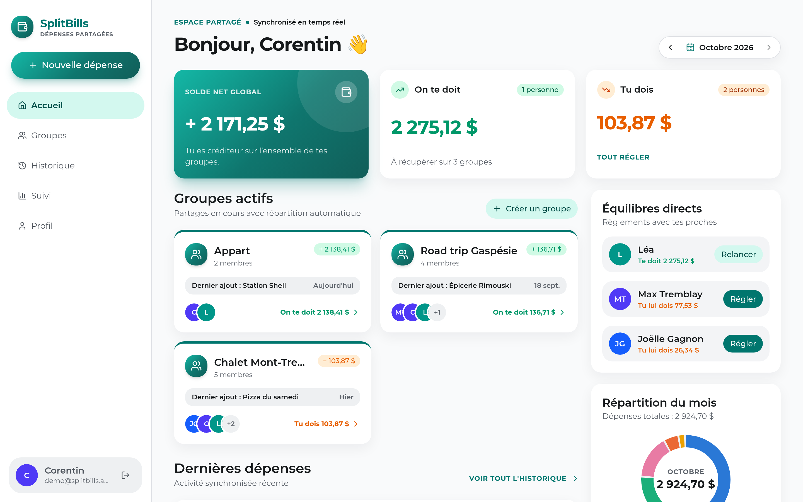
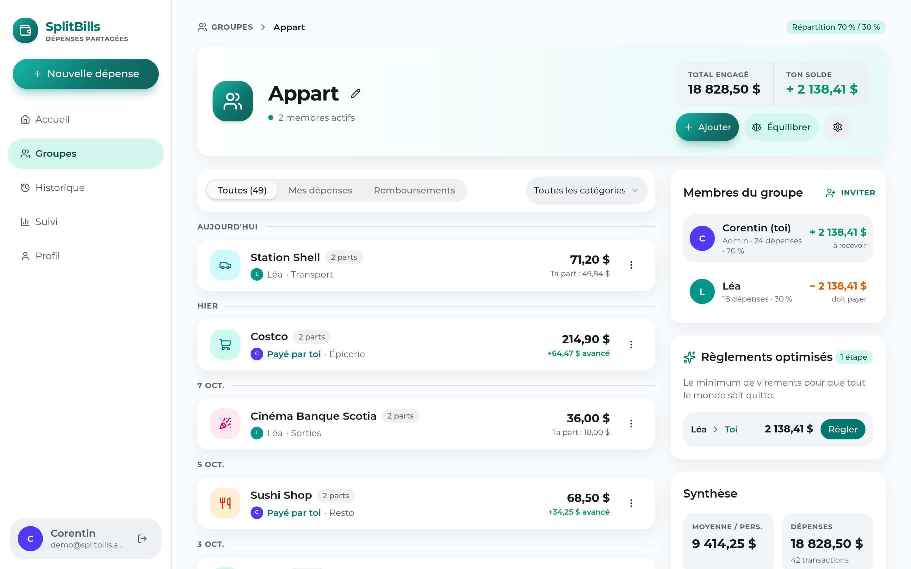
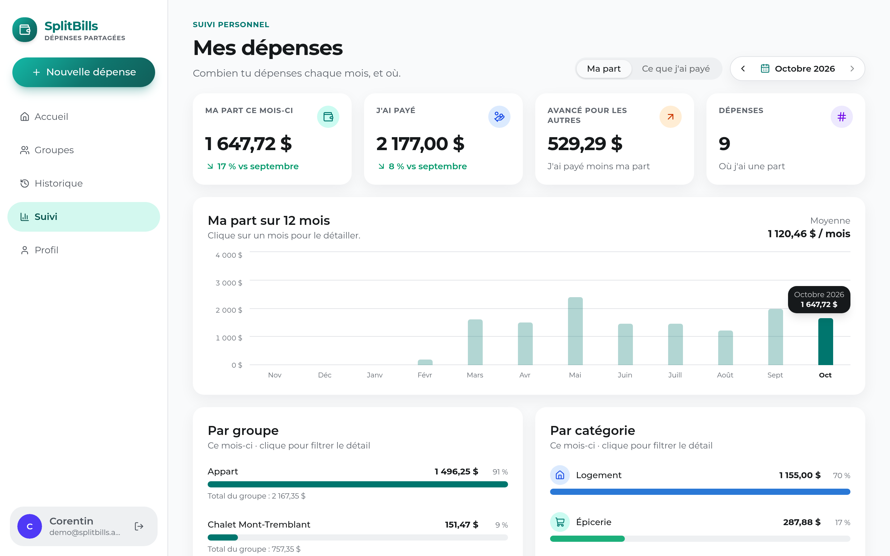
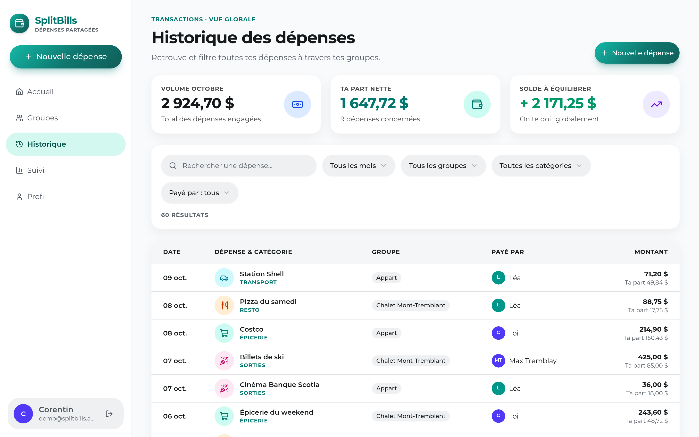
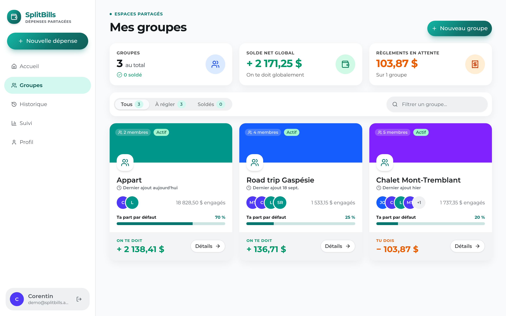
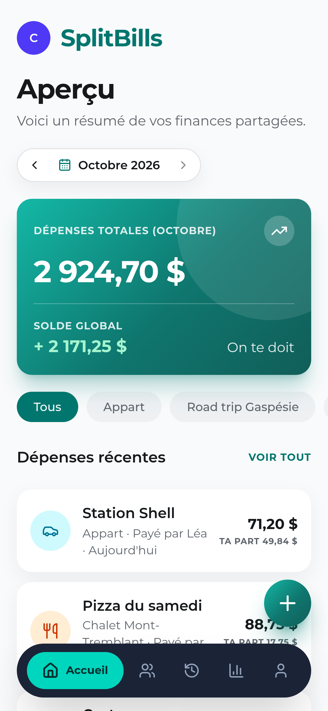
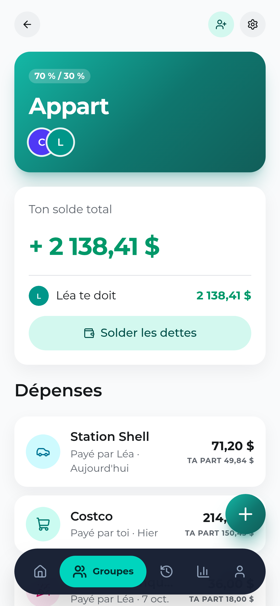
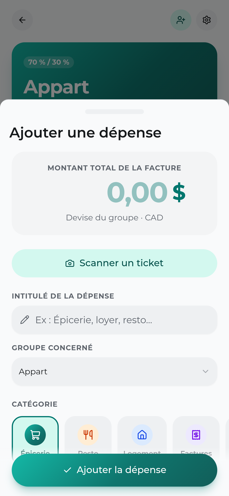
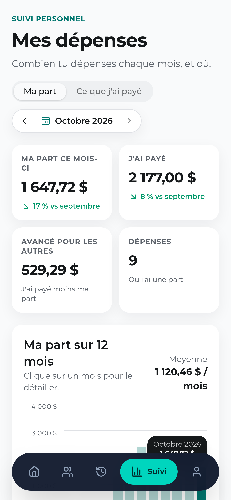

# SplitBills

Web app installable (PWA) pour partager les dépenses au prorata des revenus (ex. 70 / 30).
React + Vite + Firebase (Auth, Firestore). Scan de tickets en local avec Tesseract.js.

## Captures



| Groupe | Suivi |
|---|---|
|  |  |

| Historique | Groupes |
|---|---|
|  |  |

### Mobile

| Accueil | Groupe | Nouvelle dépense | Suivi |
|---|---|---|---|
|  |  |  |  |

## Mise en route

1. Firebase console : crée un projet, puis une **Web app** et copie sa config.
2. Active **Authentication** → *Email/Password* et *Google*.
3. Crée une base **Firestore** (mode production).
4. `cp .env.example .env` puis remplis les valeurs.
5. `npm install && npm run dev`

## Déployer (Firebase Hosting)

```sh
npx firebase-tools login
npm run build
npx firebase-tools deploy --project <projet>   # hosting + règles Firestore
```

Ajoute le domaine de hosting dans *Authentication → Settings → Authorized domains* s'il n'y est pas.

## Installer sur le téléphone

Ouvre l'URL déployée puis :
- **iPhone (Safari)** : Partager → *Sur l'écran d'accueil*
- **Android (Chrome)** : menu ⋮ → *Installer l'application*

## Modèle de données

- `groups/{id}` : `name`, `currency`, `memberIds[]`, `members{uid: {name, share}}`
- `groups/{id}/expenses/{id}` : dépense (`kind: 'expense'`, avec copie des `shares`) ou remboursement (`kind: 'payment'`)

Le lien d'invitation est `/join/{groupId}` : l'id du groupe sert de secret.

## Scripts

- `npm run dev` — serveur local
- `npm run dev:host` / `npm run demo:host` — idem, accessible depuis le téléphone via un QR code
- `npm run demo` — l'app avec des données de test en mémoire, sans Firebase (rien n'est sauvegardé)
- `npm test` — tests (soldes, parsing de tickets)
- `npm run build` — build de prod
